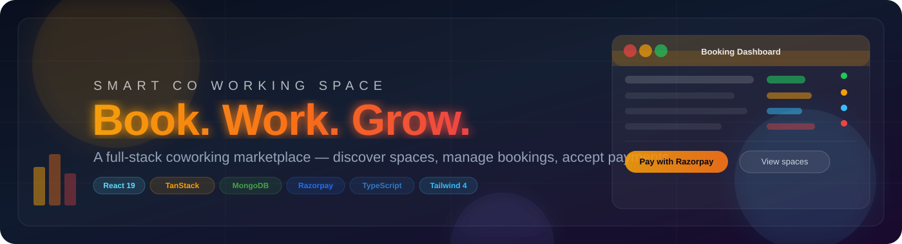

# Aperture Coworking Hub

<p align="center">
  
</p>

<p align="center">
  
  
  
  
</p>

Aperture Coworking Hub is a modern coworking marketplace experience where members discover premium workspaces, owners manage listings, and admins oversee bookings, approvals, and platform activity.

## ✨ Why it stands out

- Discover curated workspaces by city, vibe, and type
- Search and filter spaces with live-style availability cues
- Book desks, offices, rooms, and lounges in a seamless flow
- Support owner approvals and booking status updates
- Power checkout experiences with multiple payment integrations
- Provide a polished admin dashboard for users and bookings

## � Comparison tables

### Feature comparison

| Capability | Current version | Future-ready direction |
| --- | --- | --- |
| Workspace discovery | Search and filter by city, type, and price | Advanced filters, map view, and smart recommendations |
| Booking flow | Member requests and owner approval | Real-time availability, recurring bookings, and calendar sync |
| Payments | Multiple gateway integrations | Subscription plans, deposits, and invoice automation |
| Admin controls | User and booking management | Analytics dashboard, moderation tools, and reporting |
| Owner experience | Listing and booking visibility | Revenue insights, automated reminders, and performance metrics |

### Flexible vs. fixed experience

| Area | Flexible | Notes |
| --- | --- | --- |
| UI layout | ✅ Yes | Modular components make it easy to adapt the experience |
| Booking logic | ✅ Yes | Supports different booking rules and workflows |
| Payment setup | ⚠️ Partially | Configurable, but provider-specific setup is still required |
| Role-based access | ✅ Yes | Member, owner, and admin flows are already separated |
| Data model | ✅ Yes | MongoDB-backed schema can expand with new fields and entities |

## 🛣️ Feature development

| Phase | Focus area | Planned features |
| --- | --- | --- |
| Phase 1 | Core product polish | Better booking confirmation UX, clearer owner dashboards, and improved search |
| Phase 2 | Growth features | Recurring bookings, availability calendars, and member favorites |
| Phase 3 | Business tooling | Analytics, invoicing, subscriptions, and richer moderation controls |
| Phase 4 | Scale readiness | Multi-tenant support, localization, and advanced automation |

## �🚀 Quick start

```bash
npm install
npm run dev
```

## 🛠 Tech stack

- Frontend: React, TypeScript, TanStack Router, TanStack Start
- UI: Tailwind CSS, Radix UI, shadcn-style components, lucide-react
- Backend: Node.js, Vite, Nitro
- Data: Mongoose + MongoDB
- Auth & security: JWT, bcrypt, session helpers
- Payments: Stripe, Razorpay, Paystack, PayU
- Email: Nodemailer

## 📁 Project structure

```text
src/
  components/        UI layouts and reusable blocks
  hooks/             app hooks
  lib/               auth, booking, payment, database helpers
  models/            MongoDB models
  routes/            pages and API endpoints
scripts/             seed scripts for demo data
```

## ⚙️ Environment setup

Create a local environment file with the required values:

```env
MONGODB_URI=your_mongodb_connection_string
JWT_SECRET=your_jwt_secret

ADMIN_EMAIL=admin@aperture.local
ADMIN_PASSWORD=Admin123!

SMTP_HOST=your_smtp_host
SMTP_PORT=587
SMTP_USER=your_smtp_user
SMTP_PASS=your_smtp_password
EMAIL_FROM=noreply@aperture.local

STRIPE_SECRET_KEY=your_stripe_secret
STRIPE_WEBHOOK_SECRET=your_stripe_webhook_secret
RAZORPAY_KEY_ID=your_razorpay_key_id
RAZORPAY_KEY_SECRET=your_razorpay_secret
RAZORPAY_WEBHOOK_SECRET=your_razorpay_webhook_secret
PAYSTACK_SECRET_KEY=your_paystack_secret_key
PAYU_CLIENT_SECRET=your_payu_client_secret
PAYU_SALT=your_payu_salt
```

## 🌱 Seed demo data

```bash
npm run seed
```

This loads sample spaces, demo owners, and an admin account for exploration.

## 📜 Scripts

```bash
npm run dev          # start the dev server
npm run build        # create a production build
npm run preview      # preview the build locally
npm run lint         # run ESLint checks
npm run format       # format the codebase with Prettier
npm run seed         # seed all demo data
npm run seed:admin   # seed only the admin account
npm run seed:spaces  # seed only the spaces and owner links
```

## 🧪 Suggested flow

1. Install dependencies.
2. Start the development server.
3. Seed demo content.
4. Explore the landing page, space discovery view, and admin tools.

## 📝 Notes

- The platform is designed as a flexible coworking prototype and can be extended with richer analytics, moderation, and booking automation.
- Payment and email features depend on valid provider credentials, so environment configuration is required for full functionality.

<p align="center">
  <b>Built for modern teams that want their next workspace to feel effortless.</b>
</p>
